# MenuQR — Visual Architecture

> Diagram-first companion to [`ARCHITECTURE.md`](../ARCHITECTURE.md).
> Every chart below renders as Mermaid (GitHub, VS Code preview, most Markdown viewers).
> **Stack:** Next.js 14 (App Router) · React 18 · TypeScript · Tailwind · Supabase (Postgres + Auth + Realtime + Storage + Vault + Edge Functions) · Vercel.

---

## 1. System overview — 4 actors, 1 database

There is **no custom API server**. Next.js on Vercel talks **directly to Supabase Postgres**; all security and business logic live in the database (RLS + `SECURITY DEFINER` RPCs + Vault + triggers).

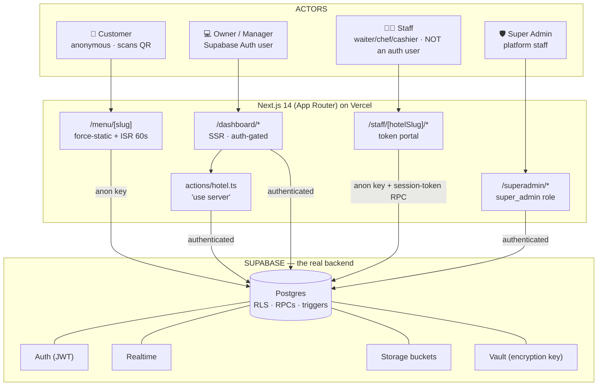

---

## 2. The three Supabase clients

The client you use is dictated by the rendering context — the single most important integration rule.

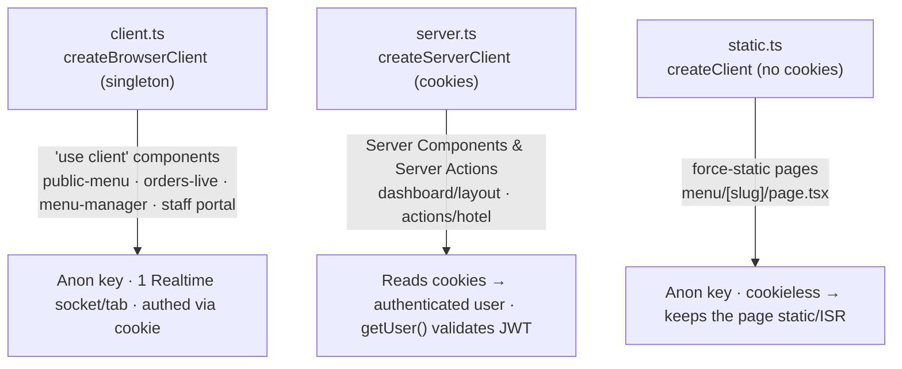

---

## 3. Entity-relationship (data model)

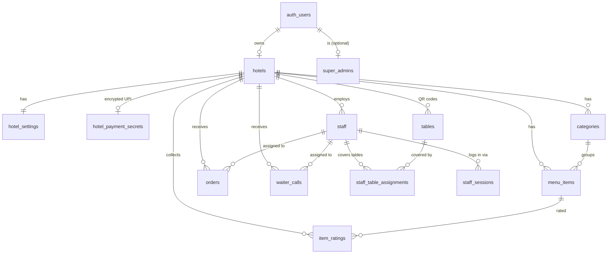

**Slug convention:** `hotel-t5-1234` = base hotel slug + table `5` + random suffix.

---

## 4. Customer ordering — the core loop

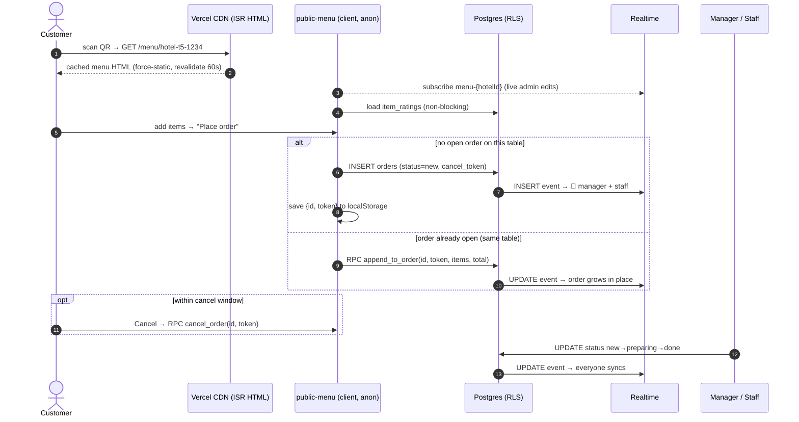

> **Why RPCs for cancel/append:** an anonymous customer must only touch *their own* order. The `cancel_token` (in `localStorage`) is verified inside a `SECURITY DEFINER` function, which safely bypasses RLS *after* the token check.

---

## 5. Staff portal — capability-token auth (migration 0012)

Staff are **not** Supabase Auth users (the app has no service-role key). They log in with mobile + password via a DEFINER RPC that returns an opaque 30-day session token (the same pattern customers use for cancel/append).

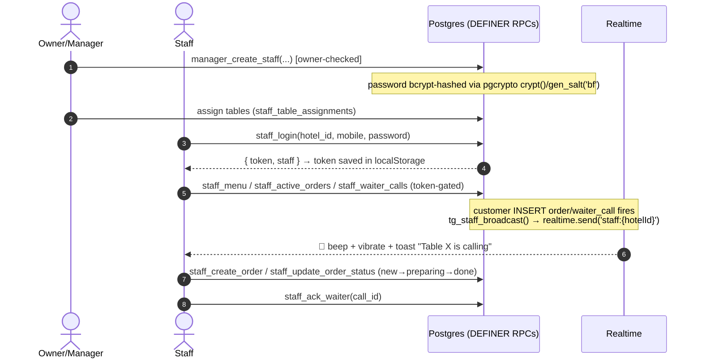

Auto-assignment: `tg_assign_staff_by_table()` stamps the covering waiter onto new orders/calls. The broadcast trigger is fully guarded — if Realtime is unavailable it silently no-ops and **never breaks the customer's order insert**.

---

## 6. Encrypted payments (UPI/GPay — migration 0007)

```mermaid
sequenceDiagram
    autonumber
    actor O as Owner
    participant SA as Server Action (actions/hotel.ts)
    participant DB as Postgres
    participant TG as encrypt trigger
    participant V as Supabase Vault

    O->>SA: saveHotelPayment({hotelId, upiId, merchantName})
    SA->>SA: getUser() + verify owns hotel
    SA->>DB: upsert hotel_payment_secrets (plaintext upi_id)
    DB->>TG: BEFORE INSERT/UPDATE
    TG->>V: read symmetric key (hotel_upi_key)
    TG->>DB: store upi_id_encrypted (bytea); set upi_id = NULL
    Note over DB: plaintext NEVER persists to disk

    O->>SA: getHotelPayment(hotelId)
    SA->>DB: rpc get_hotel_payment(hotelId)  [DEFINER, owner-checked]
    DB->>V: read key → pgp_sym_decrypt
    DB-->>SA: { upiId, merchantName }
```

`anon` is fully revoked from `hotel_payment_secrets`; the Vault key is read only inside DEFINER functions.

---

## 7. Billing / GST (migration 0011)

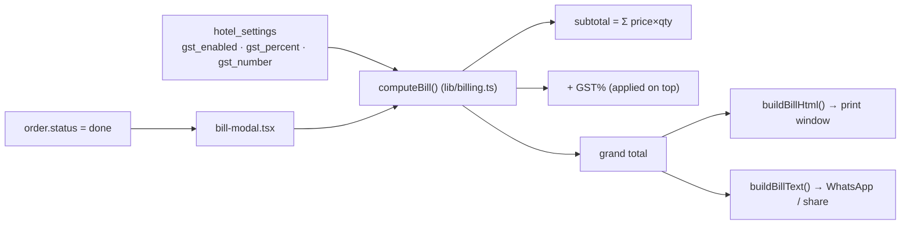

The stored `order.total` is the **pre-tax subtotal** (the customer menu never adds GST); GST is layered on at bill time only when the owner enables it.

---

## 8. Security model (enforced in the DB)

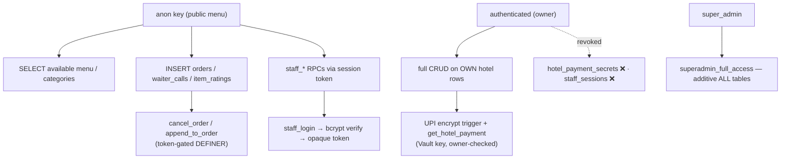

**Principles**

- RLS on every table; owner policies key off `hotel_id IN (select id from hotels where owner_id = auth.uid())`.
- Anonymous customers can insert but never read other hotels' data; cancel/append gated by a secret token.
- Staff authenticate via DEFINER RPC → opaque token (bcrypt passwords); `staff_sessions` revoked from all clients.
- Secrets (UPI) encrypted at rest with a Vault key; never decrypted client-side.
- Super admins can't self-promote (bootstrapped manually in SQL).
- Auth uses `getUser()` (server-validated JWT), not spoofable `getSession()`.

### Secret-exposure boundary

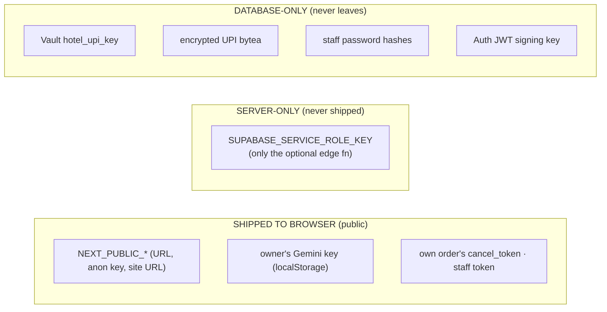

---

## 9. Route map

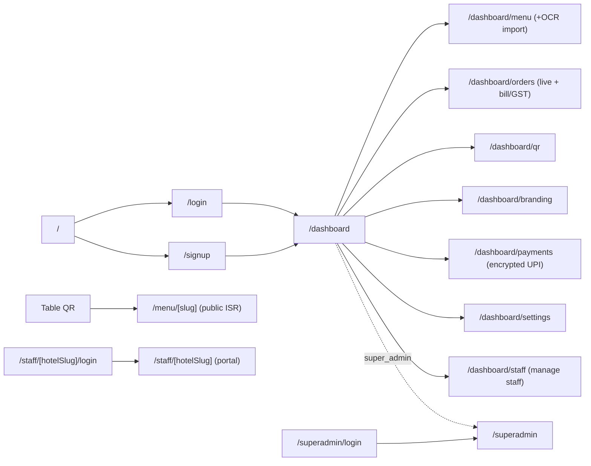

Public menu has **three layouts** (`classic` · `modern` · `premium`) selected by `hotel_settings.menu_layout`.

---

## 10. Realtime channels

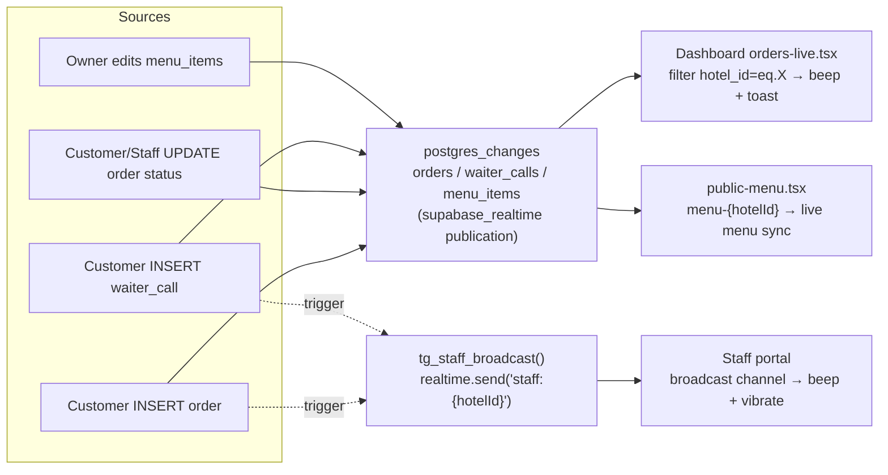

---

## 11. Migration timeline

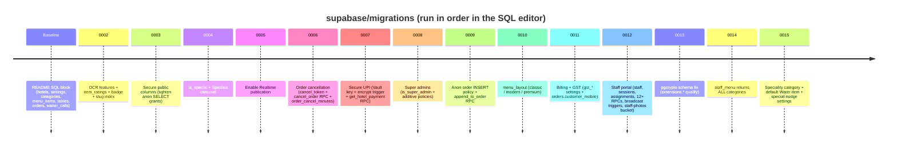
